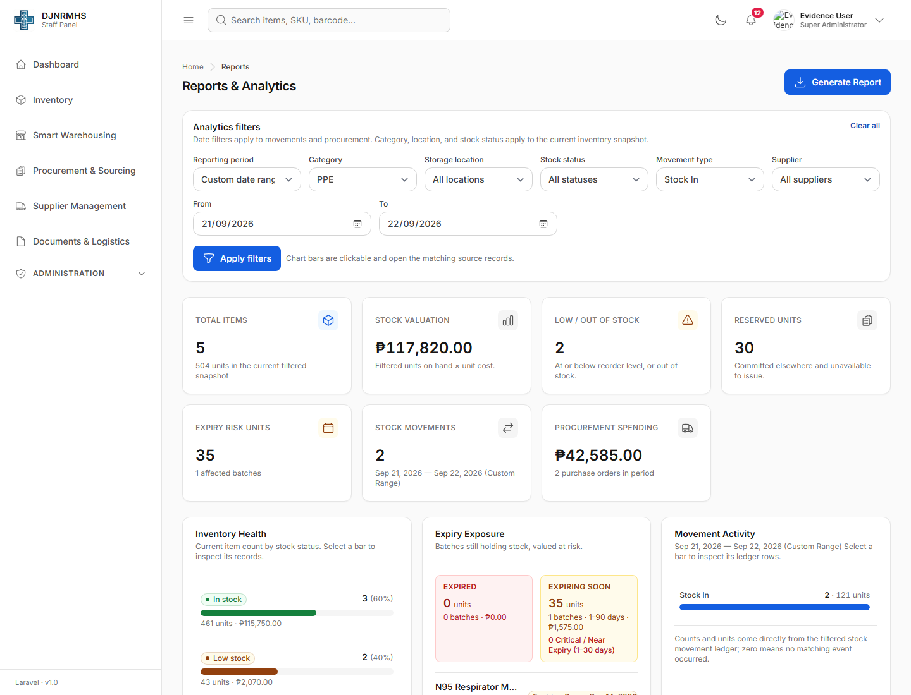
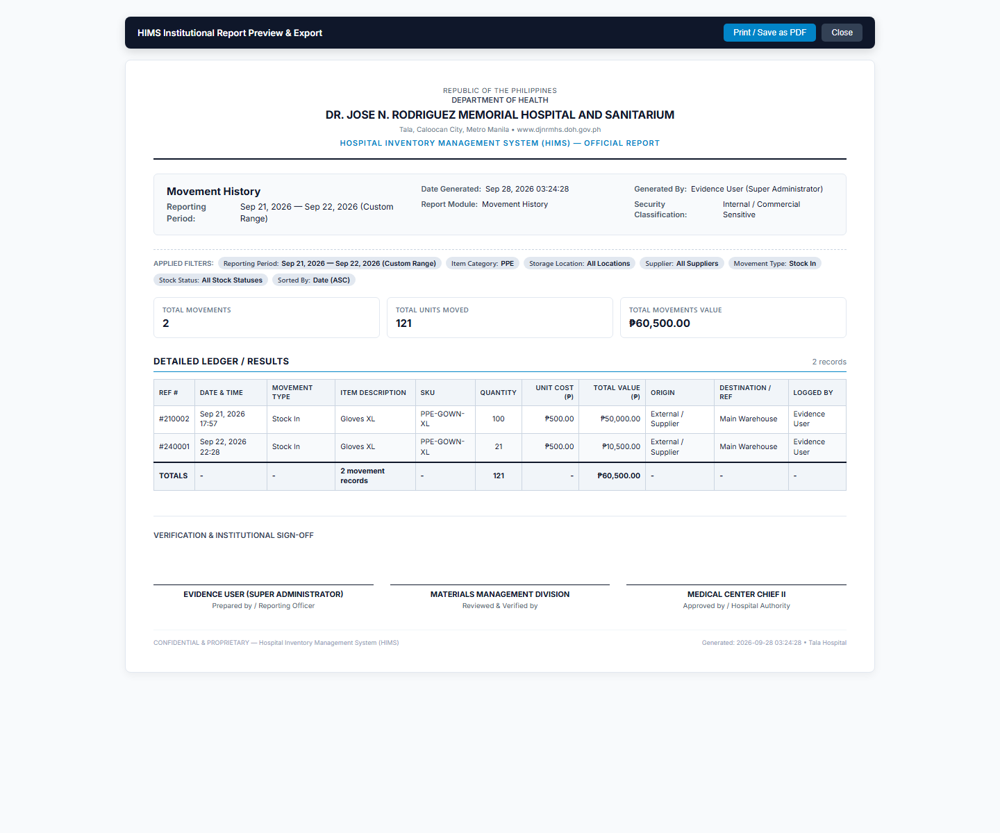

# Custom Reports demonstration

## Result

The existing Custom Reports feature is fully implemented. No duplicate reporting code was added.

## Demonstrated workflow

- Authorized role: Super Administrator (display name anonymized as `Evidence User`)
- Report: Movement History
- Reporting period: Sep 21, 2026 to Sep 22, 2026 (custom range)
- Category: PPE
- Movement type: Stock In
- Result: 2 matching records, 121 units, PHP 60,500 total value
- Output shown: on-screen analytics plus the existing printable report view

### 1. Interface and selected filters



### 2. Successfully generated report



## Existing implementation verified

- Routes: `GET /inventory/reports` and `GET /inventory/reports/generate`
- Access control: authenticated users require `view_reports`; procurement financial reports additionally require `view_procurement_sensitive_data`
- Report types: comprehensive, stock status, valuation, stock by location, expiry exposure, movement history, procurement expense, spend by supplier, most consumed items, and movements by type
- Filters: preset/custom date range, category, storage location, supplier, movement type, stock status, and allow-listed sorting
- Outputs: in-page result view, JSON, CSV, Excel, PDF, and print
- UX: responsive filters/results, loading state, validation/error messaging, and empty-result state
- Safety: server-side validation, ORM/query-builder filtering, allow-listed sort fields, permission checks, export audit logging, and aggregate-query performance coverage

## Automated verification

```text
php artisan test tests/Feature/InventoryReportTest.php --stop-on-failure

PASS  Tests\Feature\InventoryReportTest
Tests: 48 passed (401 assertions)
Duration: 6.03s
```

Coverage includes all report types across all supported formats, authentication and authorization, invalid/custom date ranges, category/location/supplier/movement/status filters, empty and large datasets, responsive result views, export correctness, and query-count performance.

The screenshots were rendered from the existing local controller, service, and Blade views against the local development dataset. Only display names in the evidence were anonymized in memory; no database records were changed.
