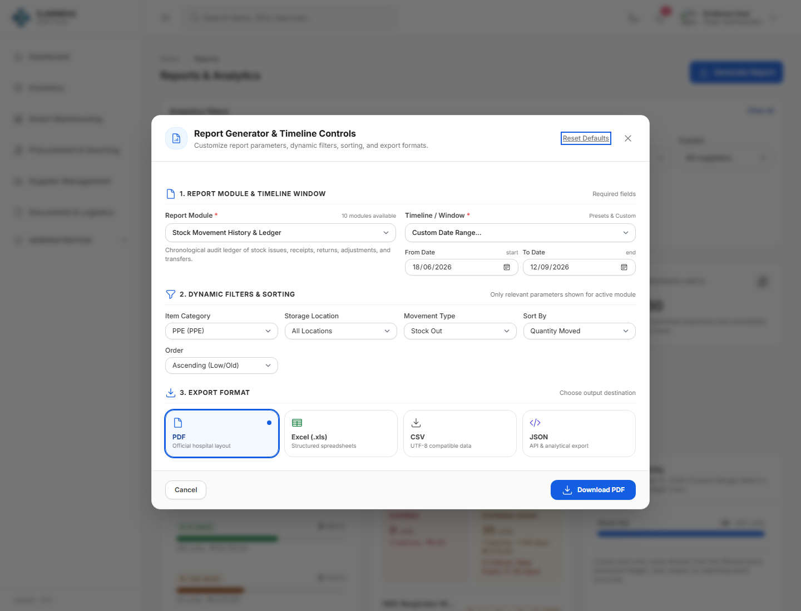
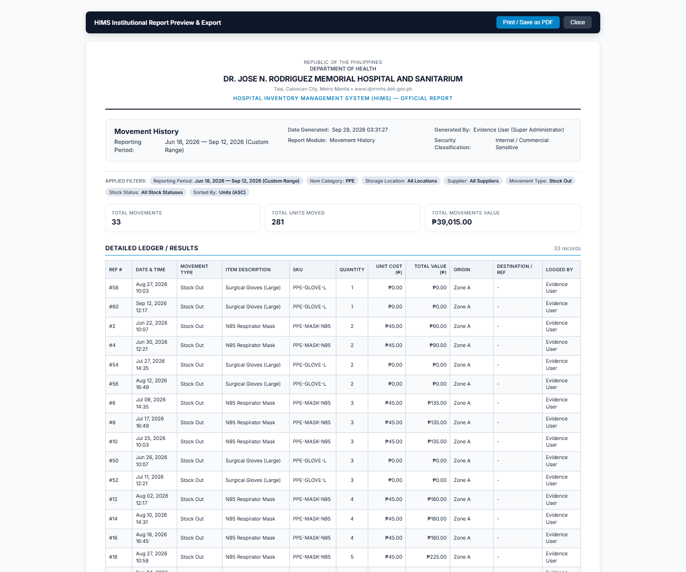

# Report Filters and Sorting sample

## Result

The project already had one Custom Reports system with backend filtering, sorting, authorization, validation, export, empty/error/loading states, and filter reset controls. Inspection found and corrected only three contract gaps:

- Movement History's `Quantity Moved` control now maps to the service's quantity column.
- Procurement Expense's `PO Number` control now sorts by `po_number`.
- The modal now shows category, location, and stock-status filters for every report type whose existing service already supports them.

No report system, dependency, route, or database object was added.

## Demonstrated workflow

- Report: Stock Movement History & Ledger
- Date filter: Jun 18, 2026 to Sep 12, 2026
- Category filter: PPE
- Movement filter: Stock Out
- Sort: Quantity Moved, ascending
- Result: 33 matching records, ordered from 1 unit upward

### 1. Filtering and sorting controls



### 2. Filtered and sorted results



The result header records every active criterion, including `Sorted By: Units (ASC)`, and the visible quantity column begins `1, 1, 2, 2...`.

## Verified behavior

- Individual and combined date/category/location/supplier/movement/status filters
- Relevant filter visibility per report type
- Ascending and descending sorting
- Active sort field and direction in report metadata
- Filter clearing/reset to an unfiltered request
- Invalid filter and sort validation
- Empty and large result handling
- Authentication, `view_reports`, and financial-report permission boundaries
- Safe allow-listed sorting and ORM/query-builder filtering
- Responsive controls, loading, error, and empty states
- JSON, CSV, Excel, PDF, and print output

Generated report exports intentionally return the complete matching result set; this flow had no paginator to preserve or combine with filters. Existing dashboard/drilldown result limits were left unchanged.

## Automated verification

```text
php artisan test tests/Feature/InventoryReportTest.php --stop-on-failure

PASS  Tests\Feature\InventoryReportTest
Tests: 50 passed (418 assertions)
Duration: 8.01s
```

The screenshots use the existing controller, service, Blade UI, and local development data. User display names were anonymized in memory; the evidence process did not change database records.
